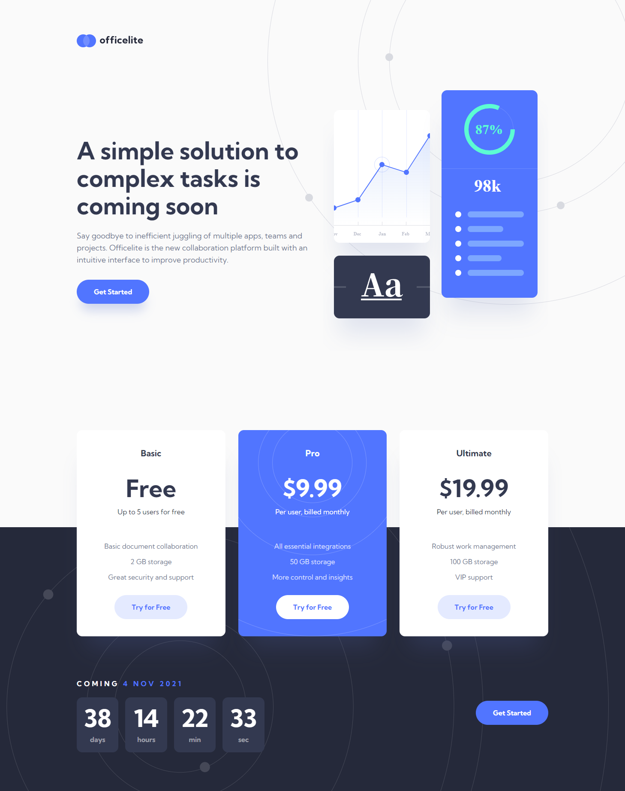
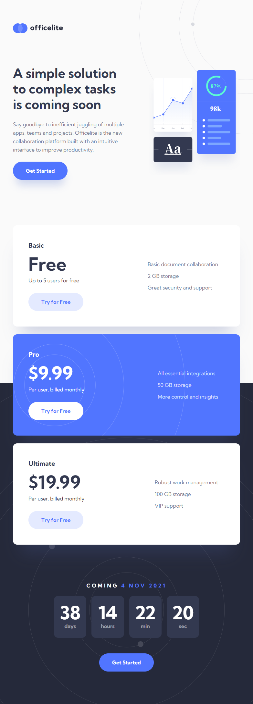
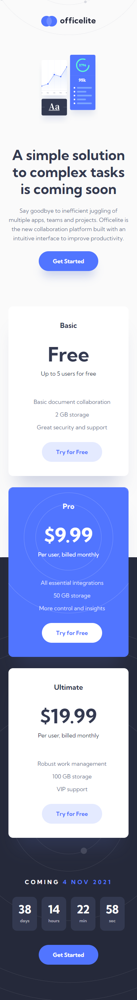

# Frontend Mentor - Officelite coming soon site solution

This is a solution to the [Officelite coming soon site challenge on Frontend Mentor](https://www.frontendmentor.io/challenges/officelite-coming-soon-site-M4DIPNz8g). Frontend Mentor challenges help you improve your coding skills by building realistic projects.

## Table of contents

- [Overview](#overview)
  - [The challenge](#the-challenge)
  - [Screenshot](#screenshot)
  - [Links](#links)
- [My process](#my-process)
  - [Built with](#built-with)
  - [What I learned](#what-i-learned)
- [Author](#author)

## Overview

### The challenge

Users should be able to:

- View the optimal layout for the site depending on their device's screen size
- See hover states for all interactive elements on the page
- See error states when the contact form is submitted if:
  - The `Name` and/or `Email Address` fields are empty
  - The `Email Address` is not formatted correctly
- See a live countdown timer that ticks down every second
- See a custom-styled `select` form control in the sign-up form

### Screenshot

### Links

- Solution URL: (https://www.frontendmentor.io/solutions/responsive-officelite-coming-soon-page-Wo0SiPjPw)
- Live Site URL: (https://lm-officelite-coming-soon.netlify.app/)

## My process

### Built with

- React/React-router
- Semantic HTML5 markup
- CSS Grid & autofit/minmax
- CSS custom properties/vars
- Desktop-first workflow
- Javascript

### What I learned

I learned how to make a dropdown component for my signup form. I was initially going to go with a native <select> element, but the styling wouldn't work as the design stated, so I used divs and buttons (not the best for accessibility unfortunately).

The countdown does count down. I initially tried to do this myself, but was overcomplicating it, getting into infinite react renders and it was a mess. I had to end up googling for a solution, which I understood how it worked afterwards.

## Author

- Website - [Leon Michalak](https://www.leonmichalak.dev)
- Frontend Mentor - [@NinjaInShade](https://www.frontendmentor.io/profile/NinjaInShade)
- Instagram - [@TheFrontendGuy](https://www.instagram.com/thefrontendguy/)
